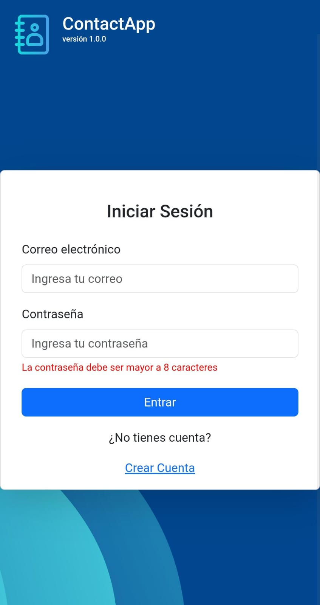
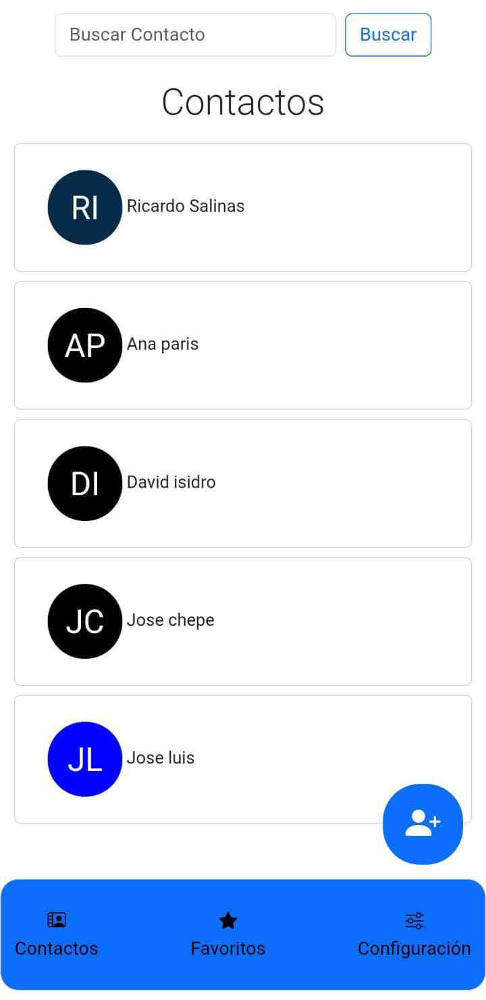
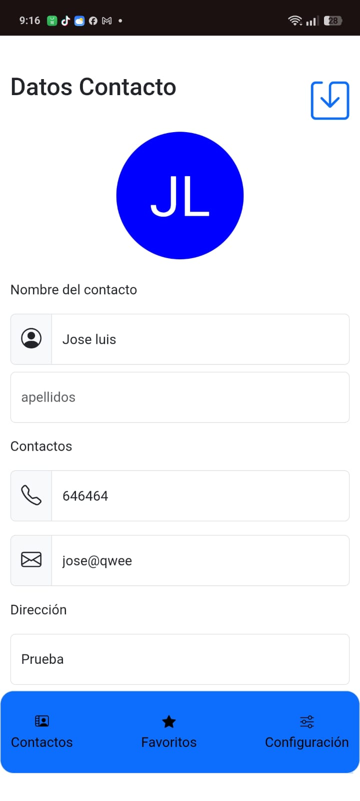
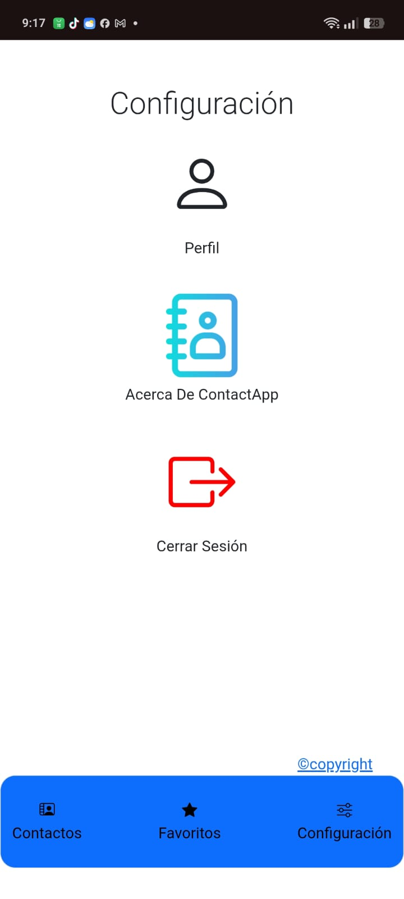
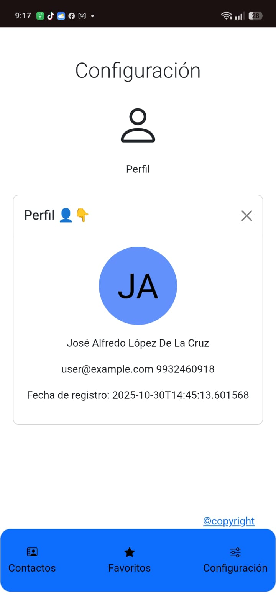
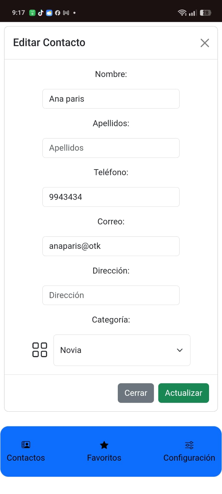
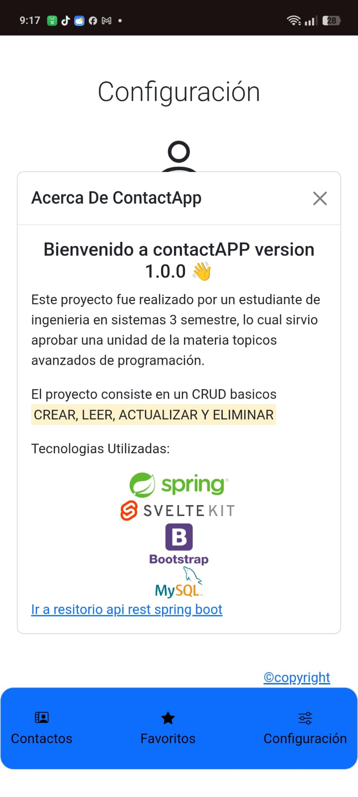
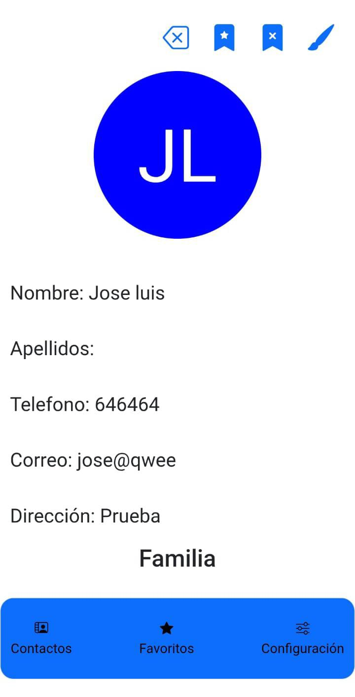

<p align="center">
	
</p>

# Proyecto WEB PWA — Agenda de Contactos

Pequeña PWA construida con SvelteKit que consume la API backend `api-contacto` (Spring Boot). Proporciona un CRUD de contactos, autenticación por sesión y una UI móvil/desktop con Bootstrap.

---
## Visualizacion

<p>
    
    
    
    
    
    
    
    
</p>
---

## Resumen
- Stack: SvelteKit (v2.x), Vite, Axios, Bootstrap.
- Propósito: frontend PWA que consume la API REST `api-contacto`.
- Requisitos backend: la API Spring Boot debería correr en `VITE_API_URL` para que la app funcione completamente.
  
---

## Requisitos
- Node.js (recomendado v16+ o la versión compatible con Vite/SvelteKit)
- npm o pnpm
- Backend `api-contacto` disponible y accesible (opcional para navegación completa)

## Instalación
1. Clonar el repositorio:

```bash
git clone https://github.com/AlfreGood20/PWA-AGENDA-DE-CONTACTO.git
cd agenda-contacto
```

2. Instalar dependencias:

```powershell
npm install
```

3. Crear `.env` (o `.env.local`) en la raíz con las variables necesarias (ver sección siguiente).

## Variables de entorno (Vite)
Define las variables en un `.env` en la raíz del proyecto:

```properties
VITE_API_URL=http://localhost:8080/api
VITE_API_AVATAR=https://ui-avatars.com/api
```

- `VITE_API_URL`: URL base del backend (sin slash final), por ejemplo `http://localhost:8080/api`.
- `VITE_API_AVATAR`: servicio para generar avatars (opcional).

> Nota: Vite expone las variables que comienzan con `VITE_` a la app cliente.

## Scripts útiles (en `package.json`)

```powershell
npm run dev       # desarrollo (vite dev)
npm run build     # construir para producción
npm run preview   # ver el build localmente
```

## Cómo ejecutar (Windows)

```powershell
npm run dev
# Abre la URL que muestre Vite (por defecto http://localhost:5173)
```

---

## Estructura (resumen)

```
agenda-contacto/
├─ src/
│  ├─ lib/
│  │  ├─ api.js            # funciones que consumen la API backend (axios)
│  │  ├─ js/
│  │  │  ├─ clases.js      # Login, contacto, Usuario
│  │  │  └─ funciones.js   # utilidades (generarAvatar)
│  │  └─ components/       # componentes reutilizables (navbar, modal, alerta...)
+│  ├─ routes/              # páginas (login, registro, menu/contactos...)
├─ static/                 # assets estáticos y manifest PWA
├─ package.json
└─ README.md
```

## Archivos importantes y su propósito
- `src/lib/api.js`: wrappers axios para la API. Todas las llamadas al backend pasan por aquí.
- `src/lib/js/clases.js`: clases constructoras para construir payloads (Login, contacto, Usuario).
- `src/lib/js/funciones.js`: utilidades, por ejemplo `generarAvatar`.
- `src/lib/components/`: componentes reutilizables:
	- `navbar.svelte` — barra inferior de navegación.
	- `barra.svelte` — encabezado / barra superior.
	- `modal.svelte` — modal genérico (props: `titulo`, `mensaje`, `visible`, `accion`, `cerrar`, `color`, `nombreBotonAccion`).
	- `alerta.svelte` — alertas (props: `color`, `mensaje`, `visible`).
- `src/routes/*`: páginas y rutas del sitio (login, registro, contactos, favoritos, configuración).

---

## Endpoints que consume la app (resumen — ver `src/lib/api.js`)

- `POST ${VITE_API_URL}/auth` — login (usa cookies de sesión). `postLogin(request)`
- `GET ${VITE_API_URL}/deauthenticate` — cerrar sesión
- `POST ${VITE_API_URL}/usuario` — registrar usuario
- `GET ${VITE_API_URL}/perfil` — obtener perfil del usuario autenticado
- Contactos:
	- `GET ${VITE_API_URL}/contactos` — lista de contactos del usuario
	- `GET ${VITE_API_URL}/contacto/{id}` — obtener contacto por id
	- `POST ${VITE_API_URL}/contacto` — crear contacto
	- `PUT ${VITE_API_URL}/contacto/{id}` — actualizar contacto
	- `DELETE ${VITE_API_URL}/contacto/{id}` — eliminar contacto
	- `PATCH ${VITE_API_URL}/contacto/{id}?estado={boolean}` — cambiar favorito

> Observación: muchas llamadas incluyen `withCredentials: true` en axios porque el backend usa `HttpSession`.

---

## Componentes clave (qué esperan y cómo usarlos)

- `modal.svelte`:
	- Props: `titulo`, `mensaje`, `visible` (boolean), `nombreBotonAccion`, `color`, `accion` (function), `cerrar` (function)
- `alerta.svelte`:
	- Props: `color` (bootstrap), `mensaje`, `visible` (boolean)

Estos componentes son diseñados para usarse desde páginas y para mantener la UI consistente.

---

## PWA
- `static/manifest.webmanifest` y `static/imgs/manifest-icons/` contienen los iconos y configuraciones.
- Para soporte offline completo añade un service worker (p. ej. `@vite-pwa/plugin`) y rutas cacheadas.

---

---


Autor: AlfreGood20

Última actualización: 2025-11-24
